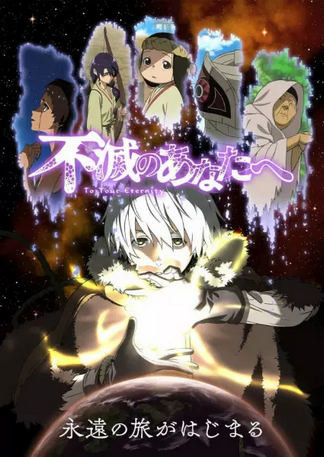

# Top 5 Anime Favorit

## 1. Otonari No Tenshi

- **Genre:** Romance, Comedy, School
- **Sinopsis:** Menceritakan tentang kisah romantis antara Amane Fujimiya, seorang siswa SMA biasa yang tinggal sendirian, dan Mahiru Shiina, tetangganya yang adalah gadis tercantik di sekolah dan dijuluki "Malaikat".

---

## 2. Horimiya

- **Genre:** Romance, Comedy, School
- **Sinopsis:** Kyoko Hori, siswi populer dan cerdas, serta Izumi Miyamura, siswa yang tampak suram dan tertutup. Di luar sekolah, keduanya memiliki rahasia: Hori adalah "ibu rumah tangga" yang mengurus adiknya, sedangkan Miyamura memiliki tindikan dan tato. Mereka bertemu secara kebetulan dan menjadi teman, lalu perlahan saling membuka diri dan mengembangkan perasaan satu sama lain. 

---

## 3. Fumetsu No Anata e

- **Genre:** Adventure, Fantasy, Supernatural
- **Sinopsis:** Menceritakan tentang makhluk abadi misterius bernama Fushi yang dikirim ke Bumi oleh entitas bernama "Beholder" untuk belajar tentang kehidupan dan manusia.

---

## 4.Kaoru Hana 

- **Genre:** Romance, School, Comedy
- **Sinopsis:** Menceritakan tentang kisah Rintaro Tsumugi, siswa dengan penampilan menakutkan dari sekolah khusus laki-laki yang terkenal berandalan, dan Kaoruko Waguri, siswi ceria dari sekolah khusus perempuan bergengsi yang bersebelahan. Pertemuan mereka dimulai di toko kue keluarga Rintaro, di mana Kaoruko tanpa prasangka buruk tertarik pada kebaikan hatinya, yang akhirnya menumbuhkan persahabatan di antara mereka yang terhalang oleh perbedaan latar belakng kedua sekolah.

---

## 5. Kimi No Nawa

- **Genre:** Romance, Fantasy, 
- **Sinopsis:** Menceritakan tentang dua remaja, Mitsuha Miyamizu dari desa terpencil dan Taki Tachibana dari Tokyo, yang tiba-tiba bertukar tubuh.

---